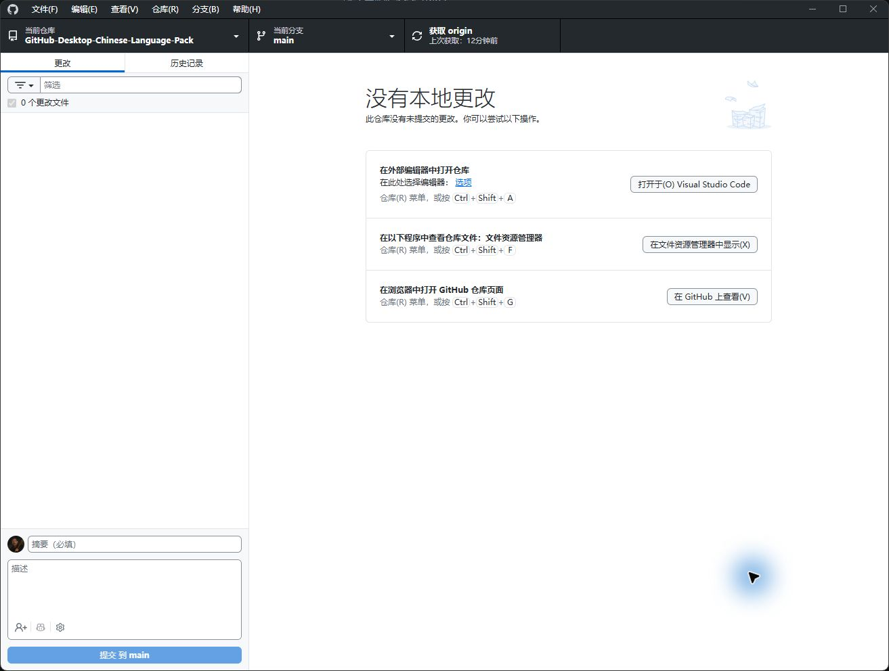
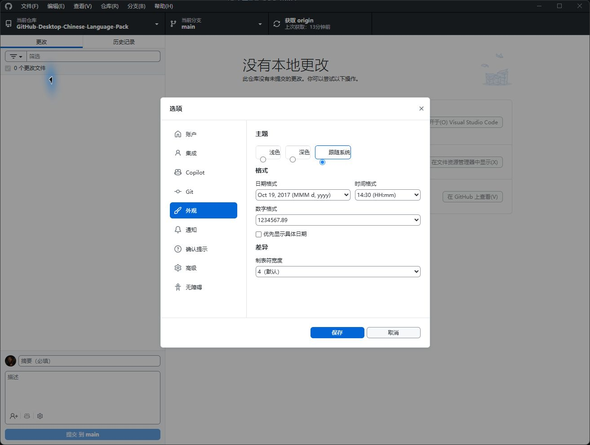
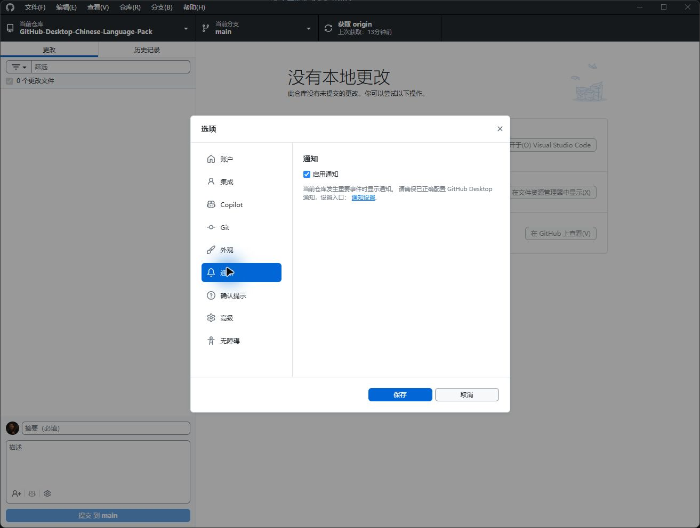
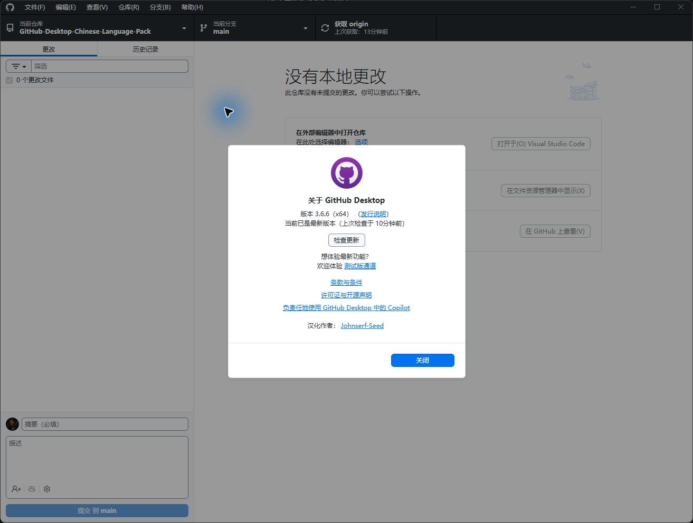

# GitHub Desktop 汉化包 · Chinese Language Pack（简体中文）

[](app-3.6.6/)
[](https://github.com/Johnserf-Seed/GitHub-Desktop-Chinese-Language-Pack/actions/workflows/update-language-pack.yml)
[](LICENSE)

**GitHub Desktop 简体中文汉化包（Chinese Language Pack）**，为 Windows 用户提供中文界面、本机一键生成工具和 GitHub Actions 定时更新。当前仓库提供 **GitHub Desktop 3.6.6 Windows x64** 的现成翻译包，生成与安装可以分别执行。

覆盖菜单、仓库和分支操作、提交与差异、设置、Copilot 和工作树等常用界面；支持原版备份、恢复英文版，并在“帮助 → 关于”显示可点击的汉化作者主页。

[下载项目 ZIP](https://github.com/Johnserf-Seed/GitHub-Desktop-Chinese-Language-Pack/archive/refs/heads/main.zip) · [查看 3.6.6 翻译包](app-3.6.6/) · [下载自动生成的包](https://github.com/Johnserf-Seed/GitHub-Desktop-Chinese-Language-Pack/actions/workflows/update-language-pack.yml) · [效果截图](#汉化效果截图) · [安装说明](#安装当前翻译包) · [生成新版](#本机一键生成)

Simplified Chinese localization for GitHub Desktop on Windows. Includes a prebuilt 3.6.6 language pack, a local package generator, a weekly GitHub Actions workflow, and manual install/restore scripts. Existing translations are reused for newer versions; new interface text may need review.

## 汉化效果截图

以下截图来自 GitHub Desktop 3.6.6 Windows x64 的实际汉化界面。点击图片可查看大图。

**仓库主界面**：中文菜单、提交区域、编辑器选择提示和操作快捷键。

[](docs/screenshots/repository-overview.jpg)

<details>
<summary>查看更多截图：外观设置、通知设置与汉化作者</summary>

**外观设置**：主题、日期时间格式和差异显示选项。

[](docs/screenshots/preferences-appearance.jpg)

**通知设置**：通知开关和中文配置提示。

[](docs/screenshots/preferences-notifications.jpg)

**关于页面**：中文版本信息与可点击的汉化作者 GitHub 主页。

[](docs/screenshots/about-translation-author.jpg)

</details>

## 安装当前翻译包

1. 下载上面的项目 ZIP，或在 Actions 中下载自动生成的包。解压后进入包含 `manifest.json` 和 `install.cmd` 的 `app-3.6.6/` 目录；Actions 下载包内的 ZIP 也需要解压。
2. 正常退出 GitHub Desktop，双击包中的 `install.cmd`。
3. 安装成功后重新启动 GitHub Desktop。

安装前会检查程序版本和文件是否匹配，并备份原版文件。程序正在运行、版本不匹配或文件校验失败时会停止。无需管理员权限。

需要恢复英文版时，退出程序，双击同一包中的 `restore.cmd`。原版备份会保留在对应版本的 `resources/app/.zh-cn-backup/` 中。请保留安装时使用的翻译包，以便恢复。

每个包仅适用于对应版本。原来的 `app-3.1.6/` 保留供旧版本使用，不能用于 3.6.6。

更新同一版本的汉化包时，请正常退出 GitHub Desktop，先运行新包中的 `restore.cmd`，再运行 `install.cmd`。有有效备份时，新包可以恢复此前由此工具安装的汉化；发现其他文件改动时会停止。

“帮助 → 关于”会显示 **汉化作者：[Johnserf-Seed](https://github.com/Johnserf-Seed)**。点击作者名会打开 GitHub 主页。

在完整项目中，也可以双击根目录的 `install.cmd` 或 `restore.cmd`。这些入口会寻找与本机版本对应的翻译包，优先使用 `dist/app-版本号/`，其次使用项目根目录的 `app-版本号/`。`scripts/` 下的同名入口也支持这种用法；找不到对应包时，请先运行 `generate.cmd`。

需要指定翻译包时，可以使用：

```powershell
.\scripts\install.ps1 -PackagePath '.\app-3.6.6'
```

`restore.ps1` 同样支持 `-PackagePath`。如果曾使用不同内容的同版本包安装，请指定安装时保留的原包进行恢复。

## 本机一键生成

双击根目录的 **`generate.cmd`**。工具会寻找本机 Node.js 22 或更新版本，也支持使用已经存在的 Codex Node.js 运行环境。未找到时，请安装 [Node.js](https://nodejs.org/) 22 或更新版本后重试。

它会自动寻找 `%LOCALAPPDATA%\GitHubDesktop\` 下版本号最大的正式版目录，生成翻译包到 `dist/`。生成过程不会安装汉化或修改 GitHub Desktop。

也可以指定版本目录：

```powershell
.\scripts\generate.ps1 -AppPath 'C:\Users\你的用户名\AppData\Local\GitHubDesktop\app-3.6.6'
```

如果这个版本已经安装过汉化，请先使用原翻译包恢复英文版，再重新生成。

## 从官方最新版生成

安装 Node.js 22 或更新版本和 [7-Zip](https://www.7-zip.org/)，然后双击 **`generate-latest.cmd`**。

它会下载 GitHub 官方 Windows x64 正式版，只解包并生成汉化包，不会运行安装程序。结果保存在 `dist/`；下载文件保存在 `work/upstream/`。

本机生成支持你已经安装的版本。从官方下载安装包生成的入口目前固定为 Windows x64。

## GitHub Actions 自动更新

仓库包含 `.github/workflows/update-language-pack.yml`。推送到 GitHub 默认分支 `main` 后，可在 Actions 页面运行 **Generate latest Chinese language pack**。

工作流每周一北京时间 10:00 检查并下载官方最新版，生成翻译包；修改词典或生成脚本后也会运行。执行成功后，在该次运行的 Artifacts 中下载压缩包。它不会自动安装到本机，也不会自动提交代码或发布 Release。上传产物保存 30 天。

## 补充和调整翻译

编辑 `locales/zh-CN.json`，修改现有翻译或添加新条目，然后重新生成。每条条目包含原文 `text`、中文 `translation` 和适用文案的位置 `sources`。

词典中的 `translationAuthor` 用于设置“关于”页显示的汉化作者，`translationAuthorUrl` 用于设置作者主页链接。待审核清单也会收集短文案和拼接句子的片段。

每个生成包包含：

- `translation-report.json`：本版本已应用的翻译和数量。
- `pending-ui-strings.json`：待审核的文案候选，可能包含不需要翻译的项目。
- `manifest.json`：版本和安装校验信息。

自动化会复用已经审核的翻译。新版本新增或改写的文案需要补充词典，未覆盖部分保留英文；当前不宣称 100% 汉化。

同一版本重新制作的包也可能与已安装的旧汉化不同。更新前请先恢复英文，再安装新包。

## 反馈漏译与参与翻译

发现英文残留或翻译不准确时，可以在 [Issues](https://github.com/Johnserf-Seed/GitHub-Desktop-Chinese-Language-Pack/issues) 提供 GitHub Desktop 版本、界面位置和截图。欢迎通过 Pull Request 补充或改进简体中文翻译。

汉化作者：[Johnserf-Seed](https://github.com/Johnserf-Seed)。

## 许可证

汉化工具按 MIT 许可证发布。GitHub Desktop 是 GitHub 的产品，相关代码和第三方库保留其原有许可证及声明。本项目是社区汉化项目。离线工具附带的 Acorn 许可证见 `scripts/vendor/acorn.LICENSE`。
